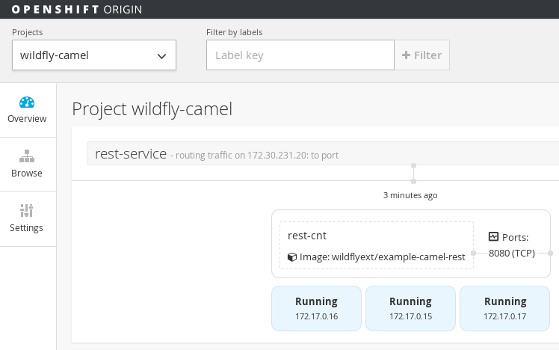
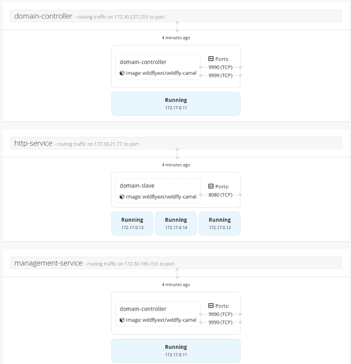

## OpenShift Origin

This chapter gets you started on WildFly-Camel in [OpenShift Origin](https://github.com/openshift/origin)  


### Starting OpenShift

We can start OpenShift Origin like this

```
$ mkdir /tmp/openshift
$ docker run --rm --name openshift-origin --net=host --privileged -v /var/run/docker.sock:/var/run/docker.sock -v /tmp/openshift:/tmp/openshift openshift/origin:v0.4.4 start
```

Then verify the OpenShift version

```
$ docker exec openshift-origin openshift version
openshift v0.4.4-9-g09f87e4
kubernetes v0.14.1-582-gb12d75d
```

We may also want to create an alias to OpenShift

```
$ alias openshift-cli="docker exec openshift-origin osc"
```

## Standalone Servers

Here we run a set of WildFly Camel servers on [OpenShift Origin](https://github.com/openshift/origin). The target platform is Linux on an Amazon EC2 instance. When done, we have a set of portable [Docker](https://www.docker.io/) containers that can be deployed onto a production platform.


The example architecture consists of a set of three high available (HA) servers running REST endpoints. For server replication and failover we use [Kubernetes](http://kubernetes.io). Each server runs in a dedicated [Pod](https://github.com/GoogleCloudPlatform/kubernetes/blob/master/docs/pods.md) that we access via [Services](https://github.com/GoogleCloudPlatform/kubernetes/blob/master/docs/services.md).

### Log in to the OpenShift server

Before we start creating pods and services, we need to authenticate against the OpenShift server. We use the default 'admin' user credentials for this.

```
$ openshift-cli login -u admin -p admin
```

### Create an OpenShift project

This allows us to create pods, services and replication controllers under our own custom 'wildfly-camel' namespace instead of the 'default' namespace.

```
$ openshift-cli new-project wildfly-camel
$ openshift-cli project wildfly-camel
```

### Running a single Pod

A simple Pod configuration for a WildFly Camel container might be defined as in [wildfly-camel-step01.json](https://raw.githubusercontent.com/wildfly-extras/wildfly-camel-book/2.3/sources/wildfly-camel-step01.json)

To create the Pod in OpenShift we do

```
$ openshift-cli create -f https://raw.githubusercontent.com/wildfly-extras/wildfly-camel-book/2.3/sources/wildfly-camel-step01.json
```

You can see the running Pod like this

```
$ openshift-cli get pods -l name=camel

POD         IP            CONTAINER(S)   IMAGE(S)                        HOST                              LABELS                STATUS
camel-pod   172.17.0.21   camel-cnt      wildflyext/example-camel-rest   localhost.localdomain/127.0.0.1   name=camel,role=pod   Running
```

and delete it again with

```
$ openshift-cli delete pod -l name=camel
```

### Adding a ReplicationController

To achieve high availability (HA), lets replicate this Pod using a ReplicationController as in [wildfly-camel-step02.json](https://raw.githubusercontent.com/wildfly-extras/wildfly-camel-book/2.3/sources/wildfly-camel-step02.json)

To create the replicated Pod in OpenShift we do

```
$ openshift-cli create -f https://raw.githubusercontent.com/wildfly-extras/wildfly-camel-book/2.3/sources/wildfly-camel-step02.json
```

We now have three Pods each running an instance of our container

```
$ openshift-cli get pods

POD                     IP            CONTAINER(S)   IMAGE(S)                        HOST                              LABELS           STATUS
rest-controller-39ywf   172.17.0.22   rest-cnt       wildflyext/example-camel-rest   localhost.localdomain/127.0.0.1   name=camel-pod   Running
rest-controller-bfxg0   172.17.0.24   rest-cnt       wildflyext/example-camel-rest   localhost.localdomain/127.0.0.1   name=camel-pod   Running
rest-controller-zlzfk   172.17.0.23   rest-cnt       wildflyext/example-camel-rest   localhost.localdomain/127.0.0.1   name=camel-pod   Running
```

### Adding a Service

The entry point into the system is a Kubernetes Service as in [wildfly-camel-step03.json](https://raw.githubusercontent.com/wildfly-extras/wildfly-camel-book/2.3/sources/wildfly-camel-step03.json)

To create a Service that accesses replicated Pods do

```
$ openshift-cli create -f https://raw.githubusercontent.com/wildfly-extras/wildfly-camel-book/2.3/sources/wildfly-camel-step03.json
```

We now have a service

```
$ openshift-cli get services -l name=camel-srv
NAME           LABELS           SELECTOR         IP              PORT(S)
rest-service   name=camel-srv   name=camel-pod   172.30.140.33   8080/TCP
                                                 172.30.0.21
```

> <small>Note, this uses a hard coded mapping in [wildfly-camel-step03.json](https://raw.githubusercontent.com/wildfly-extras/wildfly-camel-book/2.3/sources/wildfly-camel-step03.json) for publicIPs, which would have to be replaced according to your EC2 setup.</small>

From a remote client, you should now be able to access the service like this

```
$ curl http://54.154.239.169:8080/example-camel-rest/rest/greet/hello/Kermit
Hello Kermit from 172.17.0.51
```

### OpenShift Console

You can see a diagramatic overview of replication controllers, services and pods from the OpenShift console. Use a web browser
to navigate to https://localhost:8443/console. Then log in using default username 'admin' with a password of 'admin'. Then click on
the wildfly-camel project and you should see a diagram like this.



## Domain Setup

Running multiple server containers in a cloud environment is often only useful when these containers can also be managed. In the previous example we had three servers that each exposed an HTTP service reachable through a Kubernetes [Service](https://github.com/GoogleCloudPlatform/kubernetes/blob/master/docs/services.md). The management interface of these servers were not exposed. It would be virtually impossible to adjust configurations for these individual servers or the whole set. As a minimum we would like to monitor the health state of these servers so that we can possibly replace containers if needed.


### Starting the Domain

The WildFly-Camel domain can be configured as in [wildfly-camel-domain.json](https://raw.githubusercontent.com/wildfly-extras/wildfly-camel-book/2.3/sources/wildfly-camel-domain.json)

```
$ openshift-cli create -f https://raw.githubusercontent.com/wildfly-extras/wildfly-camel-book/2.3/sources/wildfly-camel-domain.json
```

and verify the resulting servies like this
```
$ openshift-cli get services

NAME                 LABELS    SELECTOR        IP               PORT(S)
domain-controller    <none>    name=ctrl-pod   172.30.237.233   9999/TCP
                                               172.30.0.21
http-service         <none>    name=http-pod   172.30.21.77     8080/TCP
                                               172.30.0.21
management-service   <none>    name=ctrl-pod   172.30.189.153   9990/TCP
                                               172.30.0.21
```
Now, you should be able to access the admin console like this: http://54.154.82.232:9990/console


The OpenShift console should display a diagram like this:



We believe that managing deployments through the WildFly admin interface does not make much sense. Instead, deployments should already be backed into containers that you spin up in the various Pods.

There is a wide spectrum of opinion on whether this also applies to configuration. Here we retain the WildFly domain configurability (i.e. mutable containers for configuration).

Feedback is welcome.
